# Normal Distribution

Function:

^2}{2\sigma^2}})

where 

\approx2.71828...)

and thus looks like:

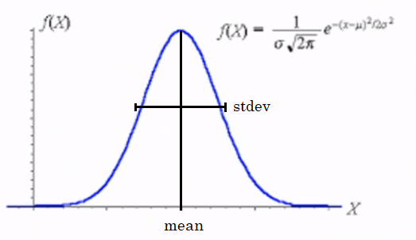

- **Standard deviation**: in the Normal Distribution function, this can be seen as the 'waist' of the bell: how wide is the bell.

- **Mean**: in the Normal Distribution function, the mean is located as the middle and highest point of the bell, coinciding with the median and mode.

It is widely used because The Central Limit theorem states that once an experiment reaches infinite tests, its frequency plot reaches this form. Therefore, most of the nature's happenings have this distribution: the mayority of the results around the same point (mean) and little amount of points are apart form this value (tails).

Thus,


In this way we can say that the Normal Distribution Function is N(\mu, \sigma), which means that the function depends on the mean and the standard deviation (some books say variance).

- If we change the mean of the distribution, but it maintains its standard deviation, the bell will just shift accross the x axis.

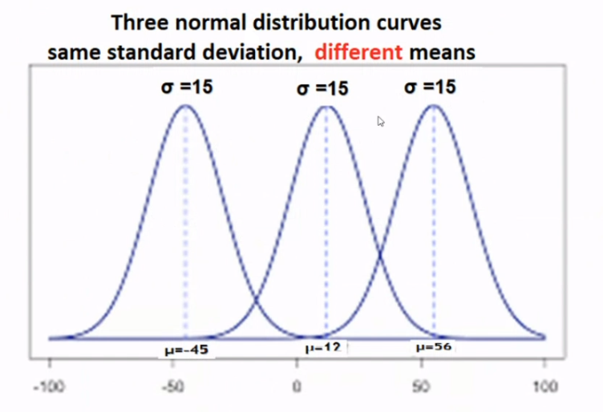

- If we change the standard deviation of the distribution, but the mean is maintained, we are changing how wide is the bell. The smaller the stdev, the thinner the bell will be; the bigger the stdev, the wider the bell is.

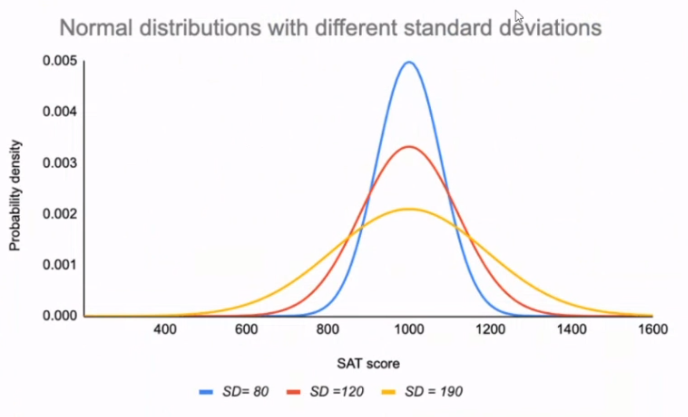

## The 68-95-99.7 Rule

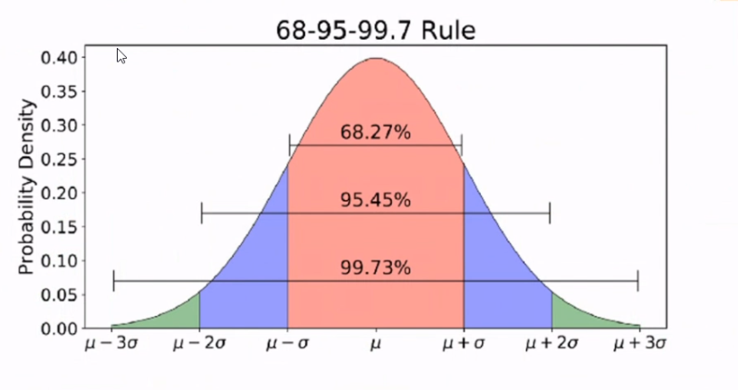

- Around **68%** of values are within **1 standard deviation** from the mean.

- Around **95%** of values are within **2 standard deviations** from the mean.

- Around **99.7%** of values are within **3 standard deviations** from the mean.

### Conclusions

The height of a group of kids has a normal distribution, with a mean of 120cm and a standard deviation of 12cm.

- Which percentage of kids have a height between 108cm and 132cm? **The range is (-sigma, +sigma) from the mean, therefore 68%.**

- Which percentage of kids have a height between 96cm and 144cm? **The range is (-2 sigma, +2 sigma) from the mean, therefore 95%.**

## Operations Over a Distribution

- **Add (+)** a constant *a* to the **data**: move the distribution accross x axis but no change in the shape of the distribution. For example, take the height of the kids: if they grow 2cm next year, the *count* for all bars in the histogram is the same: the distribution stays the same.

- **Divide or Multiply (/x)** the **data** by a constant *a*: it changes the distribution shape. When you do this to the *data values* you are separating/shrinking the distance between the databut the count of the data of a bin in the histogram stays the same: if you had 2 people with 20 dollars and 4 with 40 dollars and you multiply by 2, now you have 2 with 40 dollars and 4 with 80 dollars: the bars are more distanced (20-40 compared to 40-80), and the distribution therefore gets wider in the x axis. If you multiply by 2, the distribution gets wider in x; if you multiply by 0.5, the distribution gets tighter in x.

    - The mean is scaled to *a* x Mean.

    - The variance is scaled to *a^2* x Variance.

### Shifting (+)

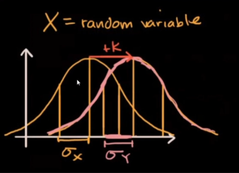

### Scaling (/x)

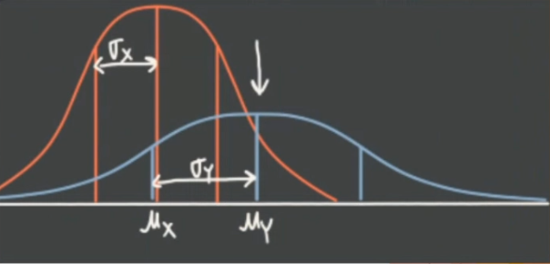

## Rules To Transform CTM Measures

If x is the previous measure and y is the new measure after transformations:

| Translation(+) by k | Scaling(x) by k |
| ---- | ---- |
| Mean y = x + k | Mean y = xk |
| Median y = x + k | Median y = xk |
| Mode y = x + k | Mode y = xk |
| Range y = x | Range y = xk |
| IQR y = x | IQR y = xk |
| Stdev y = x | Stdev y = xk |

Thus, we can say that **Range, IQR and Stdev are measures related to the shape of a distribution**, and **Mean, Mode and Median are measures related to the position of a distribution**.

### Examples

- We have a set of data **x** that presents a normal distribution, with a mean of 55, and a stdev of 8. If **x** is transformed using the expression y = 5 + 3x, find the mean and stdev of the resulting set.

    - Mean: scaled by 3 = 165, and translated by 5 = **170**.

    - Stdev: scaled by 3 = 24, and translated by 5 (does not affect) = **24**.

- In a store, a worker cuts candy bars. At the end of the day, he calculates the mean which is 105.8 gr and the stdev that is 2.2 gr. The equipment was not calibrated and therefore it had a measure error of an extra 1.5 gr. Calculate the real mean and stdev.

    - Mean: translated by -1.5 = **104.3**

    - Stdev: translated by 1.5 (does not affect) = **2.2**

## Standard Normal Distribution

A normal distribution with mean = 0 and standard deviation = 1.

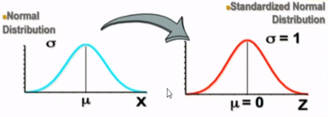

To **standarize** any distribution, we need to transform **each data point** by subtracting the mean and dividing by the standard deviation. That is, we will translate the distribution to mean = 0 and reduce the width to a stdev = 1.

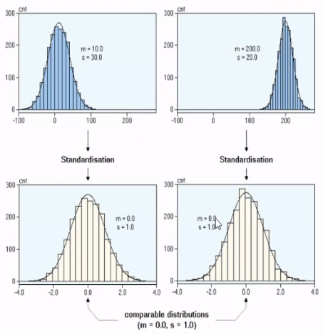

### Function

After the standarization of a distribution, the funcion shifts to being a Standard Normal Distribution Function:

^2}{2\sigma^2}}\rightarrow\frac{1}{\sqrt{2\pi}}e^{-\frac{x^2}{2}})

because 


which looks like:

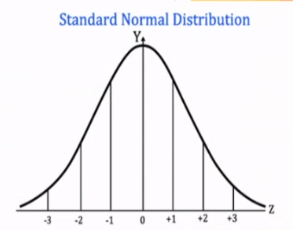

And has an area under the curve = 1.

The cumulative relative frequency tells us **the percentage of data that is smaller than a certain value in x axis**. For example, from the plot below, we can say that the 62.5% of people have less than 50 years.

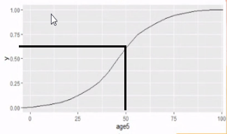


## Z-score Table

The table is basically an approximation of the integral under a z = (x - mean)/stdev function, for each of the decimal values of its z (x) axis. thus, if you have a set of data that follows a **normal distribution** and you want to know the **probability of a data point being smaller than a value x**, you can standarize that value x to its *equivalent in z* and use the table to approximate the probability, which is equal to the area under the curve until that z value.

=P(X<=x)\newline\mu=Mean\newline\sigma=Stdev\newline\bar{z}=\frac{x-\mu}{\sigma})

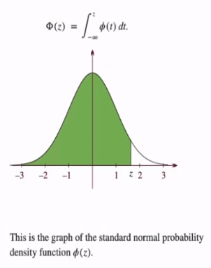

If you would've liked to know the **probability of a data point being bigger than a value x**, you use 1-F(X), where F(X) is the probability given by the data, or the area under the curve from -inf to z value equivalent of x.

### Exercises:

- [Exercise 1]()

    - Answer:

    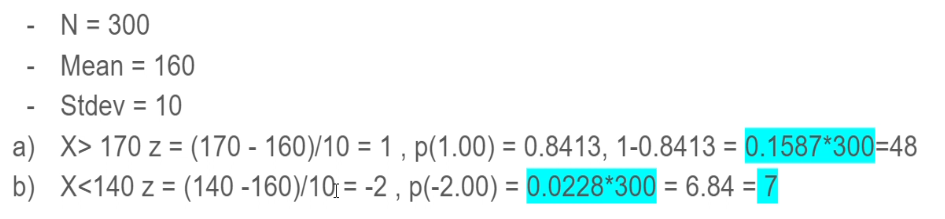

- [Exercise 2]()

- Answer:

    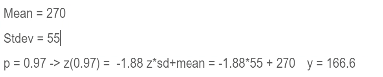

In R, instead of having to look for the probability inside a z-score table, we can use the following function:

```R
> pnorm(84, mean=72, sd=15.2, lower.tail=FALSE)
```

where x = 84 and you want upper tail probability: if `lower.tail=TRUE`, then p(X <= x); if `lower.tail=FALSE`, then p(X > x). If you have z (97% for example, 0.97), you still need to find x by hand by solving for x the equation z = (x - mean)/stdev.

## QQ Plot

In order to compare how a series of data, that have a Normal Distibution behaviour, is similar to the Standard Normal Distribution, we can use the **Quantil-quantil plot (QQ Plot)**.

```R
qqnorm(mydata$age, pch=1, frame=TRUE) # pch
qqline(mydata$age, col='magenta', lwd=2)
```

This function calculates the same quantiles for your data column and for the standard normal distribution and plot their behaviour: if the circles (input column quantiles) and the line (std distribution quantiles) follow the same path, then your column follows a normal distribution behaviour. The more the circles are distanced from the line, the less similar our data is to the normal distribution.

If, for example, the first and last few points are distant from the line, we can say that all our data except some outliers have a normal distribution.

```R
setwd('C:/Users/mariana/Documents/github-mariana/ECID1/stats-ds/week10')
mydata = read.csv("demographics.csv")

agecol = mydata$age
incomecol = mydata$income

qqnorm(agecol, pch=1, frame=T)
qqline(agecol, col='magenta', lwd=2)
```

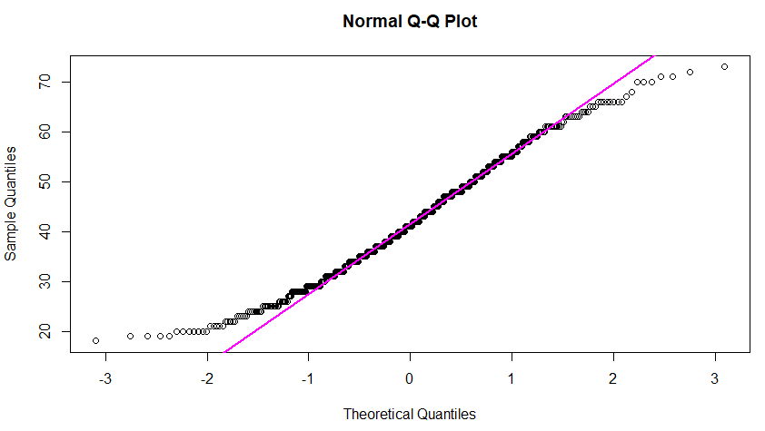