# Probability

A random experiment is a process through which we observe something uncertain.

- A **sample point (outcome)** is the result of a random experiment.

- The set of all possible results is called **sample space**.

- A simple event (trial) is the result of a random experiment.

## Flip a coin

- Random experiment: flip a coin

- Trial/Event: flip a coin **once**.

- **Sample space** omega = {Face, Cross} or omega = {C, R}

    - Event 1: C

    - Event 2: C

    - Event 3: R

----

- Trial/Event: flip a coin **three times** and observe the *sequence* of C and R. Order matters.

- Event 1: CCR

- Event 2: RCR

- Sample space: omega = {(CCC), (CCR), (CRC), (RCC), (CRR), (RCR), (RRC), (RRR)} 

    - How many *options* do we have? 8 possible *sequences*.

## Random Variable

A **random variable** is a representation that *returns* a number for each **result** of a random experiment. 

- They are represented with **X, Y or Z**, capitalized.

- The values that **X, Y or Z** take are represented by **x, y and z**.

X: omega -> R

### Examples

- Random experiment: flip a coin 

- Sample space: omega = {C,R}

- R.V.: If we are going to define our random variable as whatever results from the coin, X: omega -> R 

    - X(R) = 0 

    - X(C) = 1 (whenever we get a C we will represent with with a 1)

----

- Random experiment: throw a dice

- Sample space: omega = {1 pt, 2 pts, 3 pts, 4 pts, 5 pts, 6 pts}

- R.V.: X: omega -> R (the random variable is the result from trowing a dice once)

- X(1 pt) = 1. This says that when the dice sample point is 1 pt, the random variable value is going to be 1. X(2 pts) = 2, etc. This 1, 2, 3 can be any value: 20, 21, 22, etc. But the idea is that they have a real value related to the sample point. When the random variable is 1, the sample point is 1 pt.

----

- Random experiment: get an even number of points of a dice.

omega = {X=2, X=4, X=6}

- Event: A = {2, 4, 6}

----

- Random experiment: get a number of points of a dice less or equal to 3.

- Event: B = {1, 2, 3}, equivalent to omega = {X=1, X=2, X=3} or {X<=3}.

---- 

- Random experiment: hit the center of a circle.

- Sample space: omega = {success, fail}

- RV: X: omega -> R

    - X(success) = 1

    - X (fail) = 0

----

There are two types of random variables:

1. Discrete Random Variables: finite number of values, enumerate values, e. g. 1,2,3 ... n.

2. Continuous Random Variables: infinite number of values, values that cannot be enumerated.

## Discrete Random Variables

Examples:

- Number of washing machines that are out of service in a production day of a factory.

- Number of clients that arrive to a bank in 1 hour.

- Number of questions detected in contability process of a company in 1 year.

- Number of claims received by a company.

## Probability

How probable it is that something happens.

P(A) is the probability of A happening.

### Axioms of Probability

1. Axiom 1: For any event A, P(A) >= 0.

2. Axiom 2: Probability of the sample space S is P(S) = 1.

3. Axiom 3: If A_1, A_2, A_3... are disjoint events (independent from one another), then P(A_1 U A_2 U A_3 ...) = P(A_1) + P(A_2) + P(A_3) + ...

The probability of an event is a number between 0 and 1, that measures how probable an event is.

### Properties

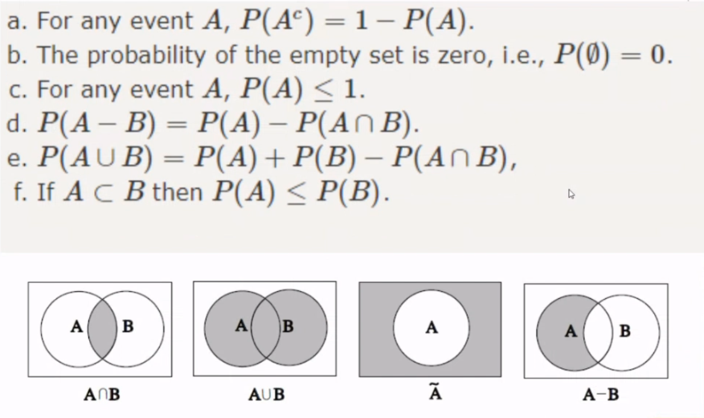

## Probability function of discrete random variable (DRV)

P_X(x) = P(X=x)

Tells us the probability of the Discrete RV **X** takes the value **x**. Because the random variable is discrete, we only have a finite number of values. Thus, the function is:

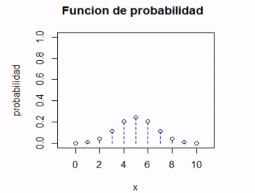

If we look at the picture, we do not have a continous line, but a series of finite points. If the DRV never takes the value of **x**, then P_X(x) = 0.

## Domain of a DRV

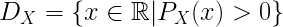

All values of x (values that RV takes) that belong to the real numbers, for which the probability of said values of x is greater than zero. Thus, if we have a value x that has probability zero, then it will not be included in the domain of the DRV.

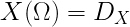

### Example

- Random experiment: throw a dice

- Sample space: omega = {1 pt, 2 pts, 3 pts, 4 pts, 5 pts, 6 pts}

- R.V.: X: omega -> R (the random variable is the result from trowing a dice once)

- X(i pts) = i (i is the value of the random variable X(i pts)).

If all faces have the same probability P_X(1) = P_X(2) = P_X(3) = P_X(4) = P_X(5) = P_X(6) = 1/6 and D_X = {1,2,3,4,5,6}

- Probability Function:

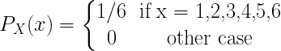

----

- Random experiment: flip a coin 

- omega = {C,R}, D_X = {0,1}

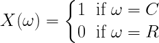

whose **probability function** is:

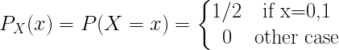

*Note: the probability of something is defined by: the amount of times an specific result can appear in an event / total of results that the event can result in.

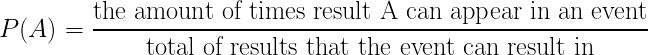

----

- Random experiment: take out *one* ball from a bag. In the bag we have 3 black balls, 4 red balls and 1 white ball.

- omega = {black, red, white}

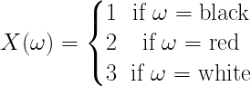

Calculate thee domain and probability expressions.

- D_X = {1,2,3}

whose **probability function** is:

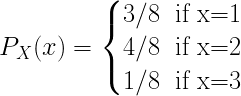

## Properties of Probability Function

- 0 <= P_X(x) <= 1 for all x -> R

- The sum of all probailities of all domain values is 1.

### Examples

- Random experiment: flip a coin three times.

- Sample space: omega = {(CCC), (CCR), (CRC), (RCC), (CRR), (RCR), (RRC), (RRR)} 

- RV: X = number of faces (C) in the three flips.

- D_X = {X=0, X=1, X=2, X=3}

P(X=0) = P((RRR)) = 1/8

P(X=1) = P((CRR), (RCR), (RRC)) = 3/8

P(X=2) = P((CCR), (CRC), (RCC)) = 3/8

P(X=3) = P((CCC)) = 1/8

whose **probability function** is:

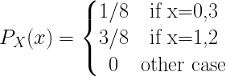

----

- Random experiment: flip a coin four times.

- Sample space:

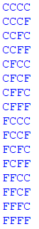

- X = Number of R’s in the 4 trials.

- D_X = {X=0,X=1,X=2,X=3,X=4}

P(X=0) = 1/16			
P(X=1) = 4/16
P(X=2) = 6/16
P(X=3) = 4/16
P(X=4) = 1/16

Thus, the **probability function is**:

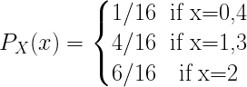

----

- Random experiment: flip a coin four times.

- Sample space:

- X = We get an odd number of reverses (R/F) in the 4 trials.

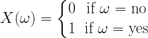

- D_X = {X=0,X=1} = {0,1}

P(x=no) = 9/16

P(x=yes) = 7/16

With the probability function:

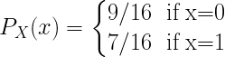

The sample space is still the same 16 combinations because we are still flipping the coin 4 times as an event, and the sample space are all the possible results from the event.

## Probability Functions

These will be the two functions that will tell us how a discrete random variable is behaving. For a discrete random variable X:

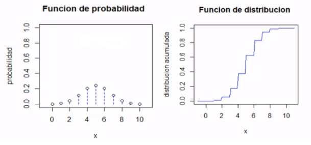

- **Probability (Distribution) Function**: the Y axis will always be at most 1, meaning the height of the bars will be less or equal than 1, and we will only have the probabilities for **specific values** accross the X axis, meaning we do not have the probability defined for all the numbers in that range, only for a finite number of values in said range.

- **Cumulative Probability (Distribution) Function**: this is the accumulated sum of the Probability Distribution Function, and thus its furthest X axis value will reach 1 in the Y axis. Because this is a Discrete Random Variable, this function is like a staircase, because the probability of some value is the same until it reaches the next value of X that has a defined probability: since we do not have the probability from the values **between** the discrete values that X takes, all that space in the plot will maintain the same probability value for the last discrete value of X we had. In fact, there should be discontinuities instead of joint points. In reality it should look like this:

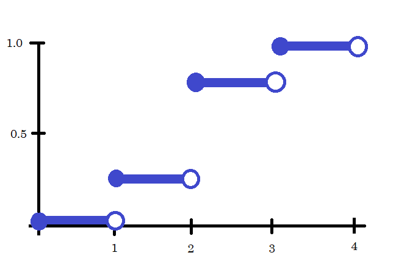

## Cumulative Prob Distribution Function

It tells us the probability of X taking values less or equal to x:

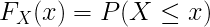

### Properties

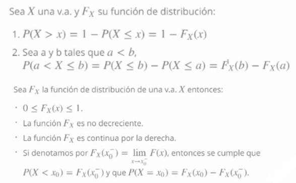

*Notes:* 

- non-decreasing means that the slope is always positive.

- F(x) is continuous by the right side. That means if we approach the points by the right side, we reach a propability at that level. If we approach a point through the left, we reach an undefined point and thus a jump in the function to the next defined probability.

    - The value that the limit has when we approach a value x of X through the right side, will be equal to the value of the function we are approaching F(X=x).

Take the following example:

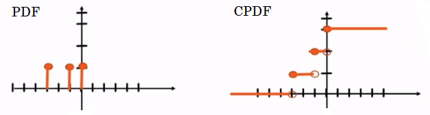

Where the PDF is:

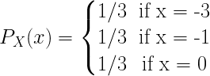

And its CPDF is:

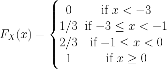

These will generate the properties if you replace <= with just <:

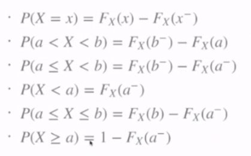

The minus over the letters means an approach from the left, a plus would mean an approach from the right. If it has nothing, then it means the function evaluated exactly at that point.

## Expected Value

Having the two functions, PDF and CPDF, we will be able to define the different distributions, and some of the measures that we will calculate will be:

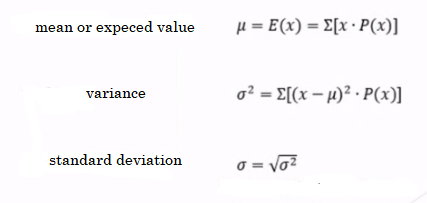

For example, the mean now is the sum of the x_i value of X, times the probability of P(X=x). We used to have the whole registry of all data in a set and we could compute the Central Tendency Measures, but now if we only have the Probability Distribution (values and their corresponding probabilities), we can also compute Central Tendency Measures, but now with the equations above. Thus, these equations above are Central Tendency Measures but based on probability.

### Example

We throw a dice 25 times, and we get the following table for each face:

| Face | Repetitions | P |
| ---- | ---- | ---- |
| 1 | 5 | 5/25 |
| 2 | 3 | 3/25 |
| 3 | 6 | 6/25 |
| 4 | 4 | 4/25 |
| 5 | 4 | 4/25 |
| 6 | 3 | 3/25 |

If we wanted to compute the mean of this data set, we would need to calculate the sum of the product of the Face and the P columns. This new ideas estimate the measures when we only have a table of probabilities. These ideas come from the fact that when we have an experiment done infinite times, the probability of X=x, is approximately the number of times x appears (n_x) over the total repetitions.

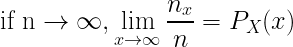

Thus we say that the mean or expected value is the **sum of the product of the variable values times their probability**. Having the CTM allows us to then make the same conclusions of tendency we talked about.

The expected value or mean for the above table is 3.32.

----

They tell us:

- X = number of errors in a text sheet.

- D_X = {0,1,2}

P(X=0)=0.42
P(X=1)=0.4
P(X=2)=0.18

- We compute E(X) = 0x0.42 + 1x0.4 + 2x0.18 = 0.76 errors

----

They tell us:

- X = dollars paid for the number of errors in a text sheet:

    - 0 dls if there are no errors.

    - 2 dls for page if there is 1 error.

    - 3 dls for page if there are 3 errors.

- D_X = {0,2,3}

P(X=0)=0.42
P(X=2)=0.4
P(X=3)=0.18

- We compute E(X) = 0x0.42 + 2x0.4 + 3x0.18 = 1.34 dls

