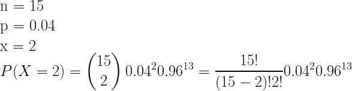

# Bernoulli Distribution

An experiment follows a Bernoulli Distribution when it only has **two outcomes (Success, Failure)**, and this experiment is done **once**. For example, *to obtain an ace* from a deck of cards or *to obtain an even number* from a dice. The probability of success in a Bernoulli trial can be known as:


Since Bernoulli trials are Binomial trials but executed only once.

- Sample space is **S = {S,F}**

- The probability of Success is **P(S) = p**

- The probability of Failure is **P(F) = 1 - p**

- RV: **X(S) = 1, X(F) = 0**

- Domain: **D_X = {0, 1}**

- Probability Function is: 


- Distribution Function is:


- Central Tendency Measures:


## R Language

- Probability - `dbinom()`

```R
p_success = 0.25
# size 1 bc bernoulli is binomial done once
dbinom(0, size=1, prob=p_success) # P(X=0)
> 0.75
dbinom(1, size=1, prob=p_success) # P(X=1)
> 0.25
```

- Generate a simple random sample, of size n - `rbinom()`

```R
p_success = 0.25
rbinom(n=50, size=1, prob=p_success)
> 0 1 0 0 0 0 0 0 0 0 1 0 1 1 0 1 0 0 0 0 1 1 0 0 0 0 1 0 0 1 0 0 0 0 0 0 0 0 1 1 0 0 1 0 0 0 0 0 0 0
p_success = 0.85
rbinom(n=50, size=1, prob=p_success)
> 1 1 1 1 1 1 1 1 1 1 1 1 1 1 1 1 1 1 1 1 1 1 1 1 1 1 1 1 0 0 0 1 1 0 1 1 1 1 1 1 1 1 1 1 1 1 1 1 1 1
```

- Plot Probability Distribution Function

```R
plot(x=c(0:1), y=dbinom(c(0:1), size=1, prob=0.25), ylim=c(0,1), xlim=c(-1,2),
     xlab="x", ylab="probability", main=c("F(x) of Bernoulli"))
lines(x=c(0,0,1,1), y=c(0,0.75,0,0.25), type="h", lty=2, col="blue")
```


- Plot Cumulative Probability Distribution Function - `pbinom()`

```R
curve(pbinom(x, size=1, prob=0.25), xlim=c(-1,2), col="blue", 
      ylab="Cumulative Distribution", main=c("F(x) of Bernoulli"))
```


Thus,

| Function | Description |
| ---- | ---- |
| dbinom | Probability |
| pbinom | Cumulative Probability (Distribution) |
| rbinom | Random sample |

# Binomial Distribution

A random experiment has the binomial distribution when it has only **two outcomes (Success, Failure)**, but now we perform this experiment **N number of times**. For example, *to obtain 3 hearts if we pull out 5 cards of a deck* or *to obtain 2 even numbers in 4 dice throws*.

An experiment (of N trials) is binomial if it has the four following properties:

- Each trial must be independent.

- Each trial is a *success* or *failure*.

- There is a fixed number of trials.

- The probability of success in each trial is constant.

The binomial probability is the probability of obtaining exactly a number of successes, assuming that we perform an specific number of independent trials.


where:

- n = number of trials (or the number being sampled).

- x = the number of successes desired.

- p = probability of getting a **success** in one trial.

- q = 1 - p = probability of getting a **failure** in one trial.

### Exercises

1. P(X=3) when n = 5 and p = 0.5


2. P(X=1) when n = 4 and p = 0.7


3. P(X=5) when n = 10 and p = 0.3


4. P(X<3) when n = 5 and p = 0.15


### Problems

1. It is known that 20% of households have a dog. If we choose 10 houses randomly, what is the probability of:

    - 3 having a dog?

    

    - Not more than 3 having a dog?

    

2. The lightbulbs are tested to determine its life span. Its found that 4% of lightbulbs are rejected. We take a random sample of 15 lightbulbs from the stock to be tested. The random variable X is the number of lightbulbs that were rejected during the test.

    - Give 4 reasons for X having a binomial distribution.

        - Each trial must be independent.

        - Each trial is a *success* or *failure*.

        - There is a fixed number of trials.

        - The probability of success in each trial is constant.

    - Use the formula to find the probability of rejecting 2 lightbulbs from the sample.

    

## Probaility Distribution Function


- Central Tendency Measures

| Measure | Equation |
| ---- | ---- |
| Expected Value E(X) |  |
| Variance Var(X) |  |
| Standard Deviation Std(X) |  |

### Exercise

Complete the **table**:

| | n | p | mean | variance | stdev |
| ---- | ---- | ---- | ---- | ---- | ---- |
| **a** | **20** | **0.5** | 10 | 5 | 2.24 |
| **b** | **50** | 0.1 | **5** | 4.5 | 2.12 |
| **c** | 250 | **0.4** | **100** | 60 | 7.74 |

