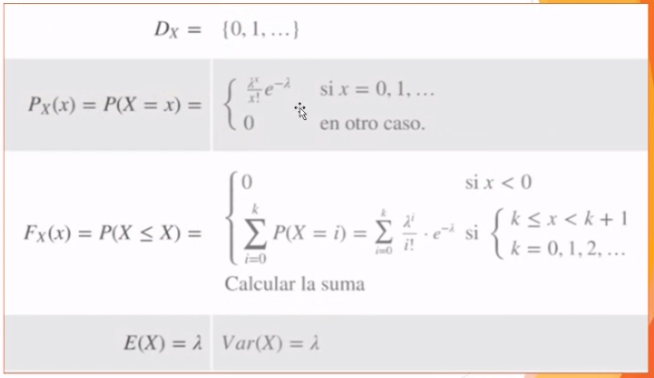

# Binomial Distribution (Cont.)

## R Language

- Probability - `dbinom()`

```R
x_value = 0
num_of_trials_in_event = 10
p_success = 0.25
dbinom(x_value, size=num_of_trials_in_event, prob=p_success) # P(X=x)
```

- Probability Function Plot

```R
# WITHOUT LINES
# we have 10 trials, thus the max number of possible successes is 10
plot(x=c(0:10), y=dbinom(c(0:10), size=10, prob=0.25),
    ylim=c(0,1), xlim=c(-1,11), xlab="x", ylab="probability of x successes",
    main="Probability Function Binomial, n=10, p=0.25")
```

```R
# WITH LINES
aux = rep(0,22) # repeat
aux[seq(2,22,2)] = dbinom(c(0:10), size=10, prob=0.5)
plot(x=c(0:10), y=dbinom(c(0:10), size=10, prob=0.5),
    ylim=c(0,1), xlim=c(-1,11), xlab="x", ylab="probability of x successes",
    main="Probability Function Binomial, n=10, p=0.5")
lines(x=rep(0:10, each=2), y=aux, type="h", lty=2, col="blue")
```


We can observe how the bump in the two plots is over a different value of x. If we remember, the **mean or expected value** is *n x p*, which in the left plot it is *10x0.25 = 2.5* and in the right plot it is *10x0.5 = 5*, and these coincide with the bump more or less (because the mode would be the exact center of the bump), but it is important to notice **the bump always follows the number of trials (x axis max num) times the success probability**. In binomial distribution, the bump depends on the value of p.


### Examples

- P(X=0): zero successes in 10 trials.

```R
dbinom(0, size=10, prob=0.25)
> 0.05631351
```

- P(X=1): one success in 10 trials.

```R
dbinom(1, size=10, prob=0.25)
> 0.1877117
```

- P(X=5): five successes in 10 trials.

```R
dbinom(5, size=10, prob=0.25)
> 0.0583992
```

----

- Distribution - `pbinom()`

```R
x_value = 0
num_of_trials_in_event = 10
p_success = 0.25
pbinom(x_value, size=num_of_trials_in_event, prob=p_success) # F(X<=x)
```

- Distribution Function Plot (Cumulative Probaility Distribution Function)

```R
x = c(0,10)
curve(pbinom(x, size=10, prob=0.5), xlim=c(-1,11), col="blue", ylab="Cumulative Ditribution",
    main="Ditribution Function")
```


### Examples

- F_X(0) = P(X <= 0)

```R
pbinom(0, size=10, prob=0.25)
> 0.05631351
```

- F_X(1) = P(X <= 1)

```R
pbinom(1, size=10, prob=0.25)
> 0.2440252
```

- F_X(5) = P(X <= 5)

```R
pbinom(5, size=10, prob=0.25)
> 0.9802723
```

----

- Generate Samples with Binomial Distribution - `rbinom()`

```R
sample_size = 50
num_of_trials_in_event = 10
p_success = 0.25
rbinom(n=sample_size, size=num_of_trials_in_event, prob=p_success) 
```

### Examples

- Generate a random sample of size 50 with binomial distribution

```R
rbinom(n=50, size=10, prob=0.25)
> 6 3 2 1 2 1 1 3 2 3 1 3 0 3 2 2 2 2 2 3 2 4 2 3 1 2 3 2 2 2 3 
1 1 2 0 4 4 3 5 1 3 4 1 3 1 2 2 2 5 1
```

*Note: each number represents the number of successes in our 10 trials, e.g., 6 successes in 10 trials, 3 successes in 10 trials, etc.*

```R
rbinom(n=50, size=10, prob=0.85)
> 9  5 10  8  7 10 10  8 10  8  9  7  9  9 10  8 10  7  9 10  
8  8  9  6  8  8 10  9 10  9  8  9 10  8  8  8 10  9  9  7  
9  9  9 10  7  7  8  9 10 10
```

Now, numbers are larger because we have a probability of success that is much greater than the first example: our successes happen more often per 10 trials.

----

## Exercises

Suppose that there is a test with 12 multiple-choice questions. Each question has 5 possible answers, and only 1 is correct. Find the probability of having 4 or less correct answers, if the student answers each question randomly.

- Per trial

    - P(success) = 1/5 = p

    - P(fail) = 4/5 = q

- Trials = 12

- Domain: D_X = {0,1,2,3,4,5,6,7,8,9,10,11,12}

- F(4) = P(x <= 4)

```R
pbinom(4, size=12, prob=0.2)
> 0.9274445
```

# Poisson Distribution

## Notation

Po(lambda)

Frequency with which an event occurs in an specific time interval (0, t].

- *lambda* is the **average** of occurrences in the interval.

> In the time period *t*, it occurs *lambda* number of events **in average**. For example, **In one hour, an average of 8 clients arrive to a shop**.

The reason behind this is:


*t* can be divided into n intervals (subintervals), and the probability of an event occuring in one of those subintervals is P_n = lambda / n. For example, **In one hour, an average of 8 clients arrive to a shop**. Here *t* is 60 minutes, and we can divide this into 60 parts of a minute. And the probability of 1 client arriving in the shop in a minute is P_n = lambda / n.

## Properties

- The average number of events in the interval (0, t] is *lambda* > 0.

- The interval of time is divided in (n) subintervals.

- The probability of 2 or more events ocurring in a subinterval is negligible, n > *lambda*

- The probability of an event occurring in a subinterval is: `P_n = lambda / n`, `P_n * n = lambda`.

## General Properties

- An event can occur any number of times in a time interval *t*. We do not have a limit.

- The events occur **independently**.

- The ratio of occurrence is **constant**, that is, the ratio does not change with time.

- The probability of an event occurring is **proportional** to the length of the period of time.

- The occurrences must be **uniformly distributed** in the anaylized interval *t*. That is why *lambda* is **average** number of occurrences. 

    - If we say *lambda* = 6 in 60 minutes, it also means that 1 event occurs every 10 minutes.

    - Let's say we are analyzing car arrival during peak hours, then we need to grab an interval where cars are arriving moreless uniformly, which is *the* peak hour, and then apply poisson for probability approximation.

## Distribution Formula


where x = number of events in an interval (desired)


### Example

In a shop, 5 clients arrive per hour, *lambda* = 5

- We consider n subintervals of 1 minute, we have n=60

- The probability of 1 client arriving in one minute: P_n = lambda / n = 5 / 60 = 0.083

> This can be seen as a generalization of a binomial probability, if dbinom(n, p=pn=lambda/n)

[More Examples](res/3.png)

## Summary



## R Language

- Probability 

```R
# lambda: number of occurrences of the event
x = 0 
dpois(x, lambda=3)
```

The probability Function Plot

```R
# poisson probability function plot
lambda = 5
n = 40

# rep: repeat zeros n times: array
aux = rep(0, (n+1)*2)
# the indices seq(2,(n+1)*2,2) leave dpois, 0, dpois, 0, etc (dpois in even spots)
aux[seq(2,(n+1)*2,2)] = dpois(c(0:n), lambda = lambda)

# max dpois value for ylim
ymax = max(dpois(0:n, lambda=lambda))

plot(x=c(0:n), y=dpois(c(0:n), lambda = lambda), ylim=c(0,ymax), xlim=c(-1,n+1), xlab="x", ylab="probability", main="Probability Function")
# y aux: dpois height, 0 height, dpois height, 0, etc
# x=rep(0:n, each=2): 1 1 2 2 3 3 4 4 ... n n
lines(x=rep(0:n, each=2), y=aux, pch=21, type="h", lty=2, col="blue")
```


### Params


- Distribution (Cumulative Probability)

```R
x = 3
ppois(x, lambda=3) # P(x <= 3)
# lower.tail = TRUE (default), P(x <= x)
# lower.tail = FALSE, P(x > x)
```

For the distribution plot (cumulative distribution plot), we can do the following:

```R
x = 3
lambda = 3
curve(ppois(x, lambda=lambda), xlim=c(-1,n+1), col="blue", ylab="cumulative distribution", main="Distribution Function")
```


- Random Sample with Poisson Distribution

```R
rpois(n=100, lambda=3)
> 6 3 6 2 2 3 1 1 1 3 4 3 3 9 4 3 1 3 1 5 3 2 6 6 0 4 5 1 3 4 8 5 3 2 6 2 3 5
 6 5 5 2 2 2 2 1 2 5 4 5 1 0 3 1 2 6 4 5 2 2 5 2 7 5 4 2 5 5 2 1 4 3 0 5 3 5 
 5 1 4 3 4 1 4 5 3 3 5 5 3 2 4 4 6 4 2 3 2 4 3 2
```

*The mayority of numbers will be around lambda value. The mean will be very close or equal to 3. Thus, each number represents the number of occurrences of the event in the time interval, that happens 100 times.*


## Lambda Location

As seen below, if we remember the **mean for poisson distribution is equal to lambda**, and thus, the bump will be nearby the mean or lambda value.


*It is important to note that poisson is a discrete distribution.*

### Exercises


2. A runner injures himself an average of 3 times per year. Calculate the probability of:

    - 4 times a year

    > lambda = 3, t = 1 year, P(X=4)

    - More than 3 times a year

    > lambda = 3, t = 1 year, P(X > 3) = 1 - P(X <= 3)

    - Once in 6 months

    > lambda = 1.5, t = 0.5 year, P(X=1)

